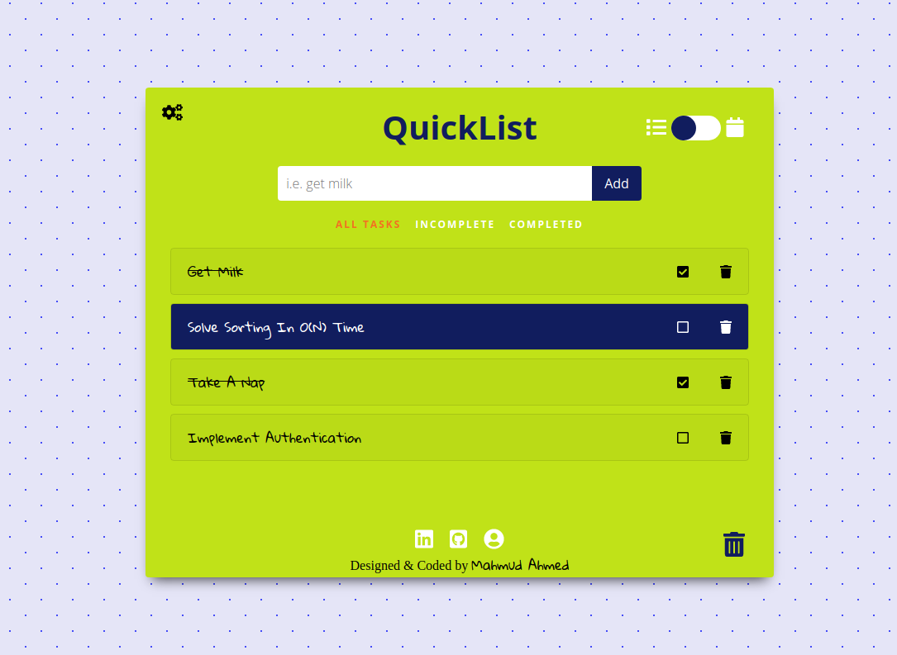
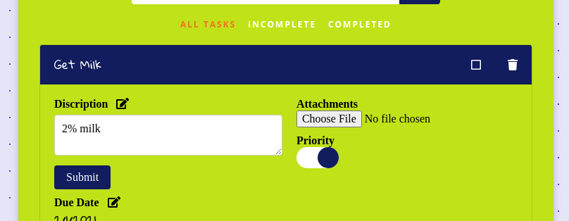
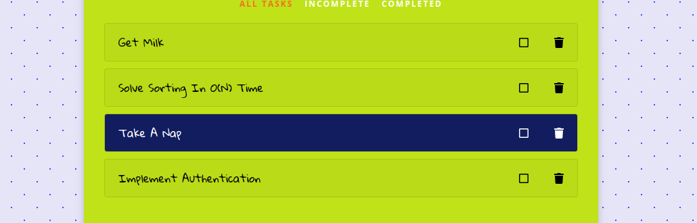
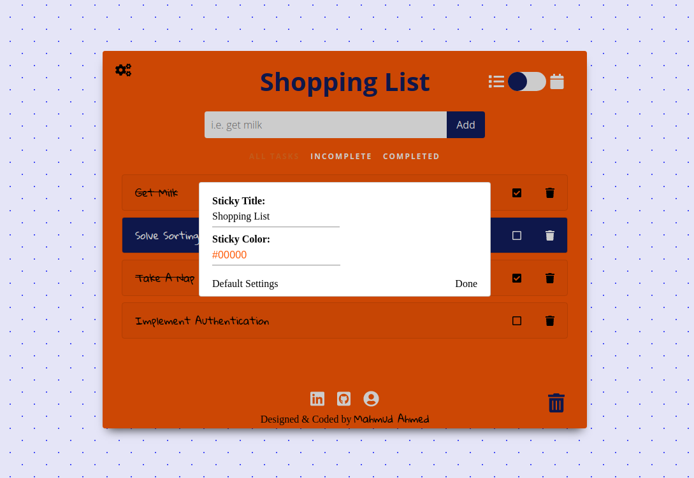

This project was bootstrapped with [Create React App](https://github.com/facebook/create-react-app).

# QuickList
***

## Description
<p align="center">
  
</p>
QuickList minimalistic single page Todo App, built with React. User are able to create multiple items that they want to remember to do and be able to add, edit, and remove tasks
 

## Technologies
* Frontend: JavaScript/React/Redux
* HTML5/CSS
* Webpack
* Firebase - Storage
* DOM Manipulation


## Installation 


### Setting up
Please run the following commands:
```
npm install (`yarn install` for mac users)
```
To install all dependencies. 


## To Run App on Local

In the project directory, you can run:

### Running the app
Please run the following commands in separate tabs:
```
npm start (`yarn start` for mac users)
```
Runs the app in the development mode.\
Open [http://localhost:3000](http://localhost:3000) to view it in the browser.

## Features 

#### Adding a new todo item
#### Editing Details to Item
#### Flag items that are a priority
#### Mark items as complete
#### Attach file to todo item
#### Filtering by Status
#### Mobile-Friendly Design 
#### Calendar View 
#### Rename and change the color of your Sticky.  


### Adding a new todo item

<p align="center">
  
</p>

Enter task title in the Text Input and click "ADD".

### Adding Details to Item

<p align="center">
  
</p>

<p align="center">
  
</p>

Add todo first, and then you can edit details in dropdown. 

### Editing Title of Todo

<p align="center">
  
</p>

Click title and edit, easy as 1,2,3. 

### Adding Due Date

<p align="center">
  
</p>

Easily add a due date and time for your task. 

### Flag items that are a priority

<p align="center">
  
</p>

Priority marking for todo. 

### Mark todo items as complete

<p align="center">
  
</p>

Easily mark-off the todo's you complete. 

### Attach file to todo item

<p align="center">
  
</p>

Attach any type of file with your todo. File stores on Firebase Storage and can be downloaded again from todo dropdown. 

### Filtering by Status

<p align="center">
  
</p>

Easily filter your tasks by incomplete/completed. 

### Mobile-Friendly Design 

<p align="center">
  
</p>

Designed with Mobile-Users in mind.

### Calendar View 

<p align="center">
  
</p>

View task's on calendar view, can be toggled on/off anytime with a click. Monthly | Weekly | Daily available. 

### Settings

<p align="center">
  
</p>

You can rename and change the color of your Sticky.  


  
## Code 


### Storing Data in Local Storage

  ```
    // save all tasks to local storage 
    export const saveToLocalStorage = (key, data) => localStorage.setItem(key, JSON.stringify(data));

    // fetch all tasks from local storage
    export const fetchFromLocalStorage = key => {
        let todoItems = [];
        const value = localStorage.getItem(key); 

        // if fetch was able to retrive data 
        if (value) {
            const parsedJSON = JSON.parse(value);
            if (Array.isArray(parsedJSON)) { todoItems = parsedJSON }
        } 
        return todoItems;
    }

    // clear data in local storage 
    export const clearLocalStorage = key => localStorage.removeItem(key);
  ```

### Updating - "force" render with Todo is updated

  ```
    const [, forceUpdate] = React.useState(true);

    const handleCompletion = (e, todo) => {
        e.stopPropagation();
        todo.done = !todo.done;

        let element = document.getElementById(`todo#${todo.id}`);
        if (todo.done) {
            element.classList.add("strikethrough")
        } else {
            element.classList.remove("strikethrough")
        }
        updateTodoInLocalStorage();

        // rerenders which Icon is showing for status.
        forceUpdate(n => !n);
    };
  ```

### Uploading Files to Cloud Storage 

  ```
    const handleUpload = (e) => {
        const file = e.target.files[0];
        const storageRef = storage.ref()
        const fileRef = storageRef.child(file.name);
        fileRef.put(file).then(() => {
            storageRef.child(file.name).getDownloadURL()
                .then((url) => {
                    todo.url = url;
                    todo.file = file.name;
                    setAttachment(todo.file)
                    updateTodoInLocalStorage();
                })
            })
        }
  ```

### Deleting Storage File associated with Todo

  ```
    const removeFromList = (todoToDelete) => {
      const filteredList = todoList.filter(todo => todo.id !== todoToDelete.id );
      
      if (todoToDelete.file) {
        // delete attachment from Storage 
        const storageRef = storage.ref()
        const fileRef = storageRef.child(todoToDelete.file);
        fileRef.delete().then(() => {
          setTodoList(filteredList);
          saveToLocalStorage("todo_list", filteredList);
        })
      } else {
        setTodoList(filteredList);
        saveToLocalStorage("todo_list", filteredList);
      }
    }
  ```

  ### handling Form submission

  ```
    const handleDetailSubmit = (e) => {
      e.preventDefault();
      todo.details = details;
      setEditMode(false);
      updateTodoInLocalStorage();
    }

    const detailsForm = () => {
      return (
          <form onSubmit={handleDetailSubmit}>
              <textarea value={details} onChange={handleDetailChange} 
                  placeholder="add a description"/>
              <input type="submit" value="Submit" />
          </form>
      );
    }
  ```

  ### Text Field Upgrade 

  ```
    const handleKeyPress = (e) => {
      if (e.key === 'Enter') {
          handleSubmit(e);
      }
    }

  ```

  ```
    <input 
      name="title"
      type="text" 
      placeholder="i.e. get milk" 
      id="text-input"
      onChange={handleChange} 
      value={todo}
      onKeyPress={handleKeyPress}
    />
  ```

  ### Stoping Propagation 

  To stop the accordian to open up when editing the title of todo.

  ```
    <input 
      onClick={e => e.stopPropagation()}
      type="text" 
      value={title} 
      onChange={handleChange} 
    />
  ```

  ### DOM Manipulation

  To stop the accordian to open up when editing the title of todo.

  ```
    // componentDidMount
    useEffect(() => {
      document.getElementById(`app`).style.backgroundColor = bgColor;
      document.getElementById("sticky-title").textContent = stickyTitle;
    }, []);

  ```


